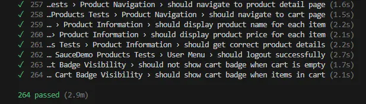
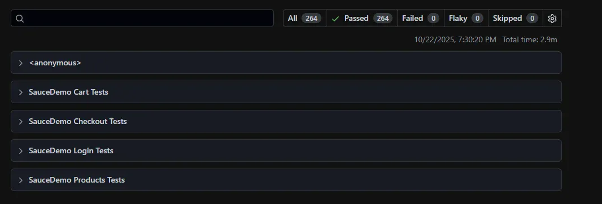
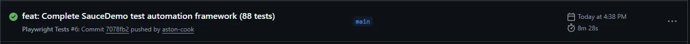

# Playwright Project Pack


> Complete test automation framework with 88 tests covering real-world e-commerce scenarios

**🎯 Production-ready code you can use in your job today**

[View Demo →](#-demo) | [Getting Started →](#-quick-start) | [Course Modules →](#-course-modules)

---

## 🌟 Highlights

- 🎯 **Production-Ready Framework** - Real working code used in professional projects
- 🚀 **88 Comprehensive Tests** - Complete e-commerce testing from login to checkout
- 📊 **100% Pass Rate** - 264 test executions across 3 browsers, all passing
- 🏗️ **Professional Architecture** - Page Object Model with TypeScript and CI/CD
- 📈 **Automated Testing** - GitHub Actions runs tests on every commit
- 📝 **Well-Documented** - Every test clearly explained with inline comments

---

## 🎓 What You'll Learn

By working through this project pack, you'll master:

### Core Testing Skills
- ✅ **Page Object Model (POM)** - Industry-standard design pattern
- ✅ **TypeScript for Testing** - Type-safe test automation
- ✅ **Cross-Browser Testing** - Chromium, Firefox, WebKit
- ✅ **Test Organization** - Scalable test suite structure

### Professional Practices
- ✅ **CI/CD Integration** - Automated testing with GitHub Actions
- ✅ **Test Data Management** - Centralized, reusable test data
- ✅ **Error Handling** - Proper waits and retry strategies
- ✅ **Professional Reporting** - HTML reports with screenshots

### Real-World Projects
- ✅ **E-Commerce Testing** - Complete SauceDemo suite (88 tests)
- ✅ **CRUD Operations** - TodoMVC application testing
- ✅ **API Testing** - REST API validation and integration

---

## 📚 Course Modules

This repository contains all projects from the **Playwright Project Pack** course:

### 📖 Module 1-3: Fundamentals
- Playwright setup and configuration
- Writing your first tests
- Locator strategies and best practices
- Understanding auto-waiting

### 🏗️ Module 4-5: Page Object Model
- Building reusable page objects
- BasePage inheritance pattern
- Test organization and fixtures
- Hooks and test lifecycle

### 🚀 Module 6-7: Real-World Projects
- **SauceDemo** (88 tests) - Complete e-commerce testing
  - Login/Authentication (~15 tests)
  - Product Browsing (~25 tests)
  - Shopping Cart (~20 tests)
  - Checkout Flow (~28 tests)
- **TodoMVC** - CRUD operations
- **API Testing** - JSONPlaceholder & FakeStore API

### 💼 Module 8: Portfolio & Career
- Professional documentation
- GitHub repository setup
- LinkedIn optimization
- Interview preparation

---

## 🚀 Quick Start

### Prerequisites
- Node.js 18 or higher
- npm or yarn
- Basic JavaScript/TypeScript knowledge

### Installation

```bash
# Clone the repository
git clone https://github.com/aston-cook/playwright-project-pack.git
cd playwright-project-pack

# Install dependencies
npm install

# Install Playwright browsers
npx playwright install

# Copy environment file
cp .env.example .env

# Run all tests
npm test
```

### Running Tests

```bash
# Run all tests
npm test

# Run tests in headed mode (see browser)
npm run test:headed

# Run specific test suite
npm run test:saucedemo
npm run test:cart

# Run with specific browser
npx playwright test --project=chromium
npx playwright test --project=firefox

# Run only smoke tests
npx playwright test --grep @smoke

# Run only E2E tests
npx playwright test --grep @e2e

# Debug mode
npm run test:debug

# View HTML report
npm run report
```

---

## 📊 Test Coverage

- ✅ **88 Test Cases** across 3 browsers (264 total test runs)
- ✅ **Login/Authentication** - ~15 tests
  - Valid user scenarios (standard, performance, problem users)
  - Invalid credentials and error handling
  - Locked user scenarios
  - Empty field validation
- ✅ **Product Browsing & Sorting** - ~25 tests
  - Product display and information
  - Sorting (A-Z, Z-A, price low-high, price high-low)
  - Add/remove products
  - Cart badge synchronization
- ✅ **Shopping Cart Management** - ~20 tests
  - Add/remove single and multiple items
  - Cart calculations and totals
  - Cart persistence across navigation
  - Empty cart scenarios
- ✅ **Checkout Flow** - ~28 tests
  - Form validation (all required fields)
  - Order overview and calculations
  - Order completion and confirmation
  - Multi-item checkout flows
  - Complete E2E purchase scenarios
- ✅ **100% Pass Rate** - 264/264 passing
- ✅ **Cross-Browser** - Chromium, Firefox, WebKit
- ✅ **CI/CD** - Automated testing on every push

### Test Execution
- **Per Browser:** 88 tests
- **Total Execution:** 264 tests (88 × 3 browsers)
- **Pass Rate:** 100% (264/264)
- **Average Duration:** ~6.9 minutes

---

## 🎯 Key Features

### 🏗️ Page Object Model Architecture
Clean, maintainable page objects with BasePage inheritance pattern. Every page follows single responsibility principle with reusable methods.

**Example:**
```typescript
export class LoginPage extends BasePage {
  async login(username: string, password: string) {
    await this.usernameInput.fill(username);
    await this.passwordInput.fill(password);
    await this.loginButton.click();
  }
}
```

### 📊 Comprehensive Test Coverage
88 tests covering complete user journeys from login to order completion. Every critical path tested across multiple browsers.

### 🚀 CI/CD Integration
Automated testing pipeline with GitHub Actions. Tests run on every push and pull request with detailed reporting.

**Features:**
- Parallel test execution
- Screenshot/video capture on failure
- HTML report generation
- Build status badges

### 📈 Professional Reporting
Beautiful HTML reports with:
- Test execution timeline
- Screenshots on failure
- Video recordings
- Detailed error logs
- Performance metrics

### 🔄 Cross-Browser Testing
Tests execute in Chromium, Firefox, and WebKit to ensure compatibility. Parallel execution reduces total runtime.

### 📝 TypeScript Implementation
Full type safety with TypeScript for:
- Better IDE autocomplete
- Compile-time error detection
- Improved code maintainability
- Self-documenting code

---

## 📸 Demo

### Test Execution


### HTML Report


### CI/CD Pipeline


[View Latest Test Run →](https://github.com/aston-cook/playwright-project-pack/actions)

Green checkmarks on every commit showing all tests passing across all browsers.

---

## 🏗️ Project Structure

```
playwright-project-pack/
├── .github/
│   └── workflows/
│       └── playwright.yml          # CI/CD configuration
├── page-objects/
│   ├── BasePage.ts                # Base class for all pages
│   └── saucedemo/
│       ├── LoginPage.ts           # Login page object
│       ├── ProductsPage.ts        # Products listing page
│       ├── CartPage.ts            # Shopping cart page
│       ├── CheckoutPage.ts        # Checkout information
│       ├── CheckoutOverviewPage.ts # Order review
│       └── CheckoutCompletePage.ts # Order confirmation
├── tests/
│   ├── saucedemo/
│   │   ├── auth/
│   │   │   └── login.spec.ts      (~15 tests)
│   │   ├── products/
│   │   │   └── products.spec.ts   (~25 tests)
│   │   ├── cart/
│   │   │   └── cart.spec.ts       (~20 tests)
│   │   └── checkout/
│   │       └── checkout.spec.ts   (~28 tests)
│   └── example.spec.ts
├── utils/
│   └── test-data.ts               # Centralized test data
├── test-data/
│   └── users.json                 # User test data
├── playwright.config.ts           # Playwright configuration
├── tsconfig.json                  # TypeScript configuration
├── package.json
├── .env.example                   # Environment variables template
├── .gitignore
└── README.md
```

---

## 👥 Who Is This For?

This project pack is perfect for:

- ✅ **QA Engineers** learning test automation
- ✅ **Developers** wanting to add testing skills to their toolkit
- ✅ **Bootcamp Graduates** building professional portfolios
- ✅ **Career Changers** entering QA from other fields
- ✅ **Students** preparing for QA automation interviews
- ✅ **Test Leads** looking for framework examples

### Prerequisites
- Basic JavaScript/TypeScript knowledge
- Understanding of web applications
- Familiarity with command line
- Git basics

**No prior Playwright or testing experience required!** The course starts from fundamentals.

---

## 🆚 Why This Project Pack?

| Feature | This Project | Other Courses |
|---------|-------------|---------------|
| **Real Applications** | ✅ SauceDemo, TodoMVC | ❌ Toy examples |
| **Production Code** | ✅ Industry-ready | ❌ Tutorial code |
| **Test Coverage** | ✅ 88+ tests | ⚠️ ~10-20 tests |
| **CI/CD Setup** | ✅ GitHub Actions | ⚠️ Not included |
| **Page Object Model** | ✅ Full implementation | ⚠️ Basic examples |
| **TypeScript** | ✅ 100% TypeScript | ⚠️ JavaScript only |
| **Cross-Browser** | ✅ 3 browsers | ⚠️ Chrome only |
| **Documentation** | ✅ Comprehensive | ⚠️ Minimal |

---

## ❓ FAQ

**Q: Do I need prior testing experience?**  
A: No! The course starts from fundamentals. Basic JavaScript knowledge is helpful but we cover everything you need.

**Q: What if tests fail on my machine?**  
A: Check the troubleshooting guide in the documentation or open an issue. Common issues are usually environment-related and easily fixed.

**Q: Can I use this code for my job?**  
A: Absolutely! This is production-ready code you can adapt for work projects. The MIT license allows commercial use.

**Q: Do I get support?**  
A: Yes! Open issues on GitHub for questions, or reach out via the contact information below.

**Q: Can I add this to my portfolio?**  
A: Yes! This is designed to be portfolio-ready. It demonstrates professional-level test automation skills.

**Q: What browsers are supported?**  
A: Tests run on Chromium (Chrome/Edge), Firefox, and WebKit (Safari). All three are included.

---

## 🛠️ Tech Stack

- **Framework:** Playwright 1.40.0
- **Language:** TypeScript 5.0+
- **Runtime:** Node.js 18+
- **CI/CD:** GitHub Actions
- **Architecture:** Page Object Model
- **Reporting:** HTML Reporter, Trace Viewer

---

## 📖 Documentation

Full documentation for each module is available in the repository:

- [Module 1: Getting Started](./docs/module-1-getting-started.md)
- [Module 2-3: Fundamentals](./docs/module-2-3-fundamentals.md)
- [Module 4-5: Page Objects](./docs/module-4-5-page-objects.md)
- [Module 6-7: Real Projects](./docs/module-6-7-real-projects.md)
- [Module 8: Portfolio](./docs/module-8-portfolio.md)

---

## 🤝 Contributing

Contributions are welcome! If you find bugs or have suggestions:

1. Fork the repository
2. Create a feature branch (`git checkout -b feature/improvement`)
3. Make your changes
4. Commit your changes (`git commit -m 'Add improvement'`)
5. Push to the branch (`git push origin feature/improvement`)
6. Open a Pull Request

---

## 📄 License

MIT License - feel free to use this code for personal or commercial projects.

---

## 👤 Author

**Aston Cook**
- GitHub: [@aston-cook](https://github.com/aston-cook)
- Email: astoncook2001@gmail.com
- LinkedIn: [Aston Cook](https://www.linkedin.com/in/aston-cook/)

---

## ⭐ Support This Project

If you find this project helpful, please:
- ⭐ **Star this repository**
- 🔗 **Share it with others**
- 💬 **Provide feedback**

Your support helps make this resource better for everyone!

---

## 🎯 Next Steps

1. ⭐ **Star this repo** to bookmark it
2. 📖 **Clone and explore** the code
3. 🚀 **Run the tests** and see them pass
4. 💼 **Add to your portfolio**
5. 🎓 **Master test automation**

**Ready to level up your testing skills? [Get started now! →](#-quick-start)**

---

<div align="center">

**Playwright Project Pack © 2025**

Made with ❤️ by a QA Engineer, for QA Engineers

[Report Bug](https://github.com/aston-cook/playwright-project-pack/issues) · [Request Feature](https://github.com/aston-cook/playwright-project-pack/issues) · [View Tests](https://github.com/aston-cook/playwright-project-pack/actions)

</div>